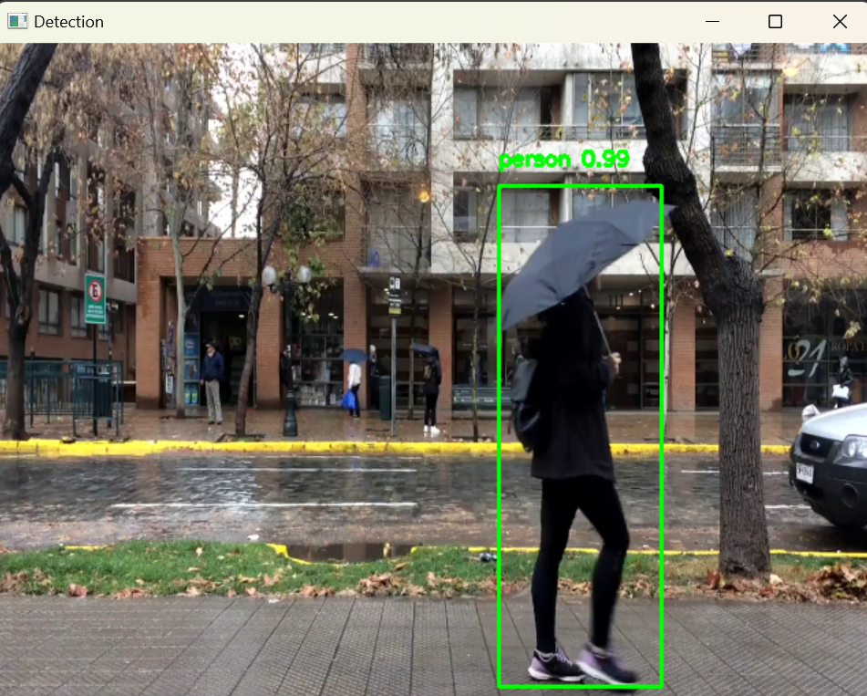

# Object Detection Using MobileNet-SSD and OpenCV

## Project Overview

This project performs real-time object detection on a video containing people and cars using the MobileNet-SSD deep learning model with OpenCV's DNN module.

The model detects multiple object classes including persons, cars, and other common objects.

---

## Files

- `Demo.py` — Python script for running object detection on video frames.
- `MobileNetSSD_deploy.prototxt` — Caffe model architecture file.
- `MobileNetSSD_deploy.caffemodel` — Pretrained MobileNet-SSD weights.
- `labels.txt` — Text file with class labels used by the model.
- `video.mp4` — Input video containing people and cars.

---

## Requirements

- Python 3.x
- OpenCV (with DNN module)  
  Install with:  
  ```bash
  pip install opencv-python

---

## Screenshot
<b>Below is a sample frame showing object detection (person) using MobileNet-SSD:<b><br>



  
  
